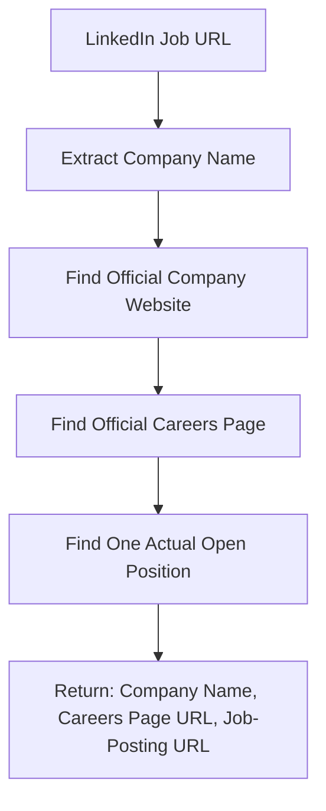

# AI Job Source Agent

This is essentially a web-research agent.

## How it works

The input is a LinkedIn job listing. From that listing, the program will:

```mermaid
flowchart TD
    A[LinkedIn Job URL] --> B[Extract Company Name]
    B --> C[Find Official Company Website]
    C --> D[Find Official Careers Page]
    D --> E[Find One Actual Open Position]
    E --> F[Return: Company Name, Careers Page URL, Job-Posting URL]
```
    
